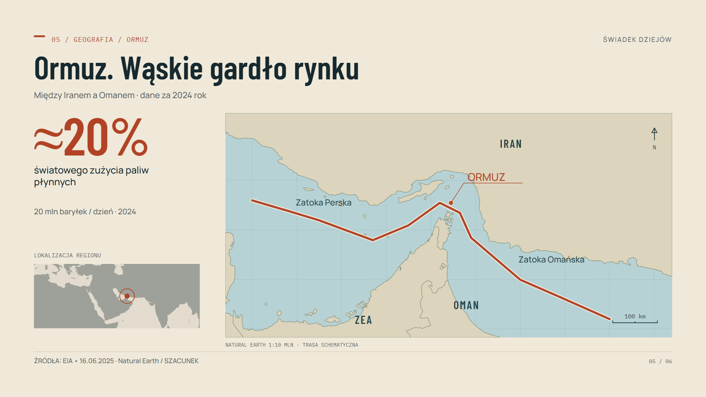

# Narrative Motion Kit

**English** · [Polski](README.pl.md)

An AI-assisted motion-design toolkit that turns narration into documentary explainers. Built for reusable production workflows; the included Polish demonstration was created for Świadek Dziejów.



A narration-led motion-design framework for documentary explainers. Author a validated scene timeline, reuse visual recipes, render any absolute time in Chromium, inspect a contact sheet, and encode a film with narration and provenance.

The editorial principle is simple: **visuals should explain something beyond what the narrator says.** This repository combines TypeScript, SVG/HTML, local photographs and geography, data-driven charts, optional Canvas/Three.js layers, Playwright, and ffmpeg. It implements a focused scene library rather than a list of nominal templates.

The completed [revised 19.6-second demonstration](examples/demo-fuel-prices-v2.mp4), [contact sheet](examples/contact-01.jpg), [validation record](docs/VALIDATION.md), and [creative review](docs/DEMO_REVIEW.md) are included. Revision 2 adds detailed regional geography, stronger compositions and protected transition titles; inspect the [map comparison](examples/map-before-after.jpg) and [five preset samples](examples/style-presets.jpg). The earlier film is retained in `examples/v1/`. Media credits and reuse terms are in [MEDIA_LICENSE.md](MEDIA_LICENSE.md) and [the source list](examples/SOURCES.md).

## Start here

Install Node.js **22.12 or newer**, and put `ffmpeg` and `ffprobe` on your PATH. Then run from the repository root:

```bash
git clone https://github.com/RolePlayingTech/narrative-motion-kit.git
cd narrative-motion-kit
npm ci
npx playwright install chromium
npm run dev -- --project demo-fuel-prices
```

Open the local URL printed by the preview command. On a fresh Linux host, Playwright may also require its system browser dependencies. Fonts and production media are local after installation/acquisition.

In Windows PowerShell, use `npm.cmd` and `npx.cmd` in these commands if the PowerShell shim consumes named arguments after `--`.

```bash
# A single exact-time frame
npm run render:frame -- --project demo-fuel-prices --time 12.4

# Scene start / middle / end samples, labeled with time and scene ID
npm run render:contact -- --project demo-fuel-prices

# Fast draft, then full project resolution with audio
npm run render:draft -- --project demo-fuel-prices --workers 2
npm run render:final -- --project demo-fuel-prices --workers 2 --resume

# Static, browser, and available final-video checks
npm run qa -- --project demo-fuel-prices

# Start another film
npm run new:project -- my-video
```

Outputs are under `projects/PROJECT_ID/renders/`. The final video is `renders/final/PROJECT_ID.mp4`; its directory also contains `SOURCES.md` and technical QA. Contact sheets are in `renders/contact/`. See [the canonical CLI reference](scripts/CLI.md) for range rendering, sampling, resolution overrides, transcription, resume behavior, and output details.

## Make a film

### Using an AI agent

Attach your narration file and give the agent this instruction:

> Use Narrative Motion Kit to make a finished film from the attached recording. Read AGENTS.md, docs/AGENT_PLAYBOOK.md and prompts/CREATE_VIDEO.md. Analyze the entire file and its narrative structure, establish verified speech timestamps, and match the visible content precisely to what is being said. Research and download useful authentic images, including portraits of important named people. Choose the style autonomously, inspect the film with audio, revise synchronization and visual weaknesses, and deliver the final video with sources and QA.

The [agent playbook](docs/AGENT_PLAYBOOK.md) is the detailed operating instruction. The user supplies the recording; the agent handles analysis, research, asset selection, storyboarding, timing, rendering and review. Speech recognition/forced alignment requires tools available to that agent; the repository's plain-text alignment is approximate and cannot certify precise synchronization.

Give an agent [prompts/CREATE_VIDEO.md](prompts/CREATE_VIDEO.md) with narration, optional transcript, brief, and assets. The repository also includes a portable [create-documentary skill](.agents/skills/create-documentary/SKILL.md) and [AGENTS.md](AGENTS.md).

1. Copy narration into the new project's `narration/` directory and configure its relative path.
2. Run audio ingestion, then align project duration and scene boundaries to its measured duration.
3. Research, cache assets, and write a storyboard with sources and visual information gain.
4. Implement with the scene DSL, inspect a contact sheet and draft, and revise actual weaknesses.
5. Render final video, run QA, generate sources, and record the creative review.

```bash
npm run audio:ingest -- --project my-video --transcript transcript/narration.txt
npm run assets:check -- --project my-video
npm run render:range -- --project my-video --from 0 --to 3
```

Plain-text transcript timing is an explicitly approximate starting point. Supplied timestamp JSON and an external local-command provider are also supported. No paid transcription service or downloaded speech model is required by the renderer.

## What is implemented

- Absolute-time rendering and half-open scene intervals, keyed randomness, easing, keyframes, closed-form springs, path interpolation, camera/framing utilities.
- Strict JSON/YAML schema, source/claim/dataset records, asset manifest, local path checks, narration ingestion, and metadata provenance.
- Twelve DSL scene families: statistic, portrait-duel, photo, evidence, flow, breakdown, line-chart, bar-chart, geo-flow, timeline, comparison, and custom.
- Semantic transition recipes, responsive layout foundations, Polish typography, five selectable art directions and light evidence/data pages, SVG/DOM composition, Canvas particle-flow and a lazy Three.js globe extension.
- Exact-time frames, ranges, contact sheets, drafts, final H.264/AAC video, parallel browser pages, fingerprinted frame reuse, and ffprobe validation.
- Agent workflow, research and asset policies, visual grammar, a weighted creative rubric, and a reusable project template.

See [scene catalog](docs/SCENE_CATALOG.md) for precise capabilities and limits. A schema-valid project is not automatically a factual, readable, or polished film.

Agents select the most suitable style for each film using [art direction](docs/ART_DIRECTION.md). Maps use retained geographic datasets, with [geographic and sea-route checks](docs/MAPS.md); the framework does not generate coastlines.

## Demonstration

`demo-fuel-prices` is a 19.6-second, six-scene demonstration of an illustrative pump price, balanced archival political portraits, constitutional evidence, a mechanism, a real geographic map of Hormuz, and historical Brent observations. Dates and illustrative assumptions are explicit, including the officeholders' historical roles in 2024. It uses a checked-in synthetic Polish narration WAV; rendering does not depend on the Windows voice used during initial creation.

The demo is an engineering and editorial example, not a report on current fuel prices or current officeholders. [Demo research](docs/DEMO_RESEARCH.md) records the verified historical inputs. Media licenses are independent of the framework's software license; preserve each asset's attribution and usage terms.

`scene-gallery` is a separate 36-second silent gallery with nine scenes: photo, timeline, statistic, comparison, bar-chart, breakdown, and working Three.js, Canvas, and DOM extensions. It includes a bar-to-layer bridge and uses local assets. The gallery demonstrates components; it is not a finished narrated documentary.

```bash
npm run dev -- --project scene-gallery
npm run render:contact -- --project scene-gallery
npm run test:gallery
```

## Read by task

| Task                     | Guide                                                                                                                         |
| ------------------------ | ----------------------------------------------------------------------------------------------------------------------------- |
| Produce a complete video | [AI workflow](docs/AI_WORKFLOW.md), [master prompt](prompts/CREATE_VIDEO.md)                                                  |
| Decide what to show      | [Storyboarding](docs/STORYBOARDING.md), [visual grammar](docs/VISUAL_GRAMMAR.md)                                              |
| Pick and extend scenes   | [Catalog](docs/SCENE_CATALOG.md), [adding scenes](docs/ADDING_SCENES.md), [transitions](docs/TRANSITIONS.md)                  |
| Handle facts and media   | [Research](docs/RESEARCH_POLICY.md), [assets](docs/ASSET_POLICY.md), [data](docs/DATA_VISUALIZATION.md), [maps](docs/MAPS.md) |
| Work with audio          | [Audio](docs/AUDIO.md)                                                                                                        |
| Render and diagnose      | [Rendering](docs/RENDERING.md), [CLI](scripts/CLI.md), [troubleshooting](docs/TROUBLESHOOTING.md)                             |
| Assess quality           | [Rubric](docs/QUALITY_RUBRIC.md), [review prompt](prompts/REVIEW_VIDEO.md)                                                    |
| Understand architecture  | [Architecture](docs/ARCHITECTURE.md), [reference analysis](docs/REFERENCE_ANALYSIS.md)                                        |

## Development

```bash
npm run check
npm run test:integration
npm run test:gallery
npm run test:preview
npm run build
npm run format:check
```

The scripts run the available checks; current run results belong in the delivery/review record rather than a permanent README claim. Runtime code lives in `packages/`, browser preview in `apps/preview/`, command tools in `scripts/`, and facts/assets/scenes in each project.

`npm run build` creates a production preview in `dist/`, including local project manifests and media while excluding render outputs and caches. Run `npx vite preview --host 127.0.0.1` and open `http://127.0.0.1:4173/?project=demo-fuel-prices` (or the port printed by Vite). The build is a local, self-contained preview; publishing it requires a separate hosting action and a review of the included media rights.

Determinism means the same project and time in the same pinned runtime produce the same visual result. Cross-platform GPU/font/codec byte identity is not promised. Vertical output requires separate composition review. Research, transcription, image generation, and licensing still require editorial judgment; the framework makes their inputs and checks explicit.

## License

Framework code is licensed under [MIT](LICENSE). Photographs, fonts, data and narration have separate terms in [MEDIA_LICENSE.md](MEDIA_LICENSE.md) and [the source list](examples/SOURCES.md). The combined demonstration and original graphic contributions are offered under CC BY-SA 4.0 with attribution preserved. The code license does not relicense third-party media.
